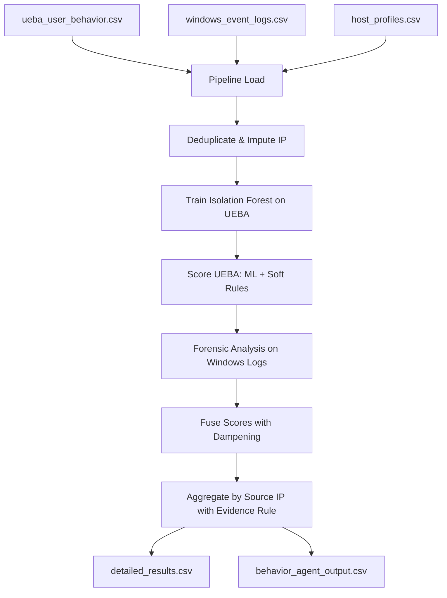

# GIBL Behavior Agent: Detailed Architecture, Pipeline, and Code Documentation

This document explains the finalized GIBL Behavior Agent in simple language, walking through the inputs, processing steps, code functions, and outputs, with definitions for all technical terms.

---

## 1. Glossary of Technical Terms

- **UEBA (User and Entity Behavior Analytics):** Systems that monitor normal user activities and flag when a user behaves in an unusual way.
- **Honeypot:** A decoy computer system set up as a trap to detect and log unauthorized access by hackers.
- **Deduplication:** The process of identifying and removing duplicate logs to prevent analyzing the same event multiple times.
- **IP Imputation:** A statistical term for filling in missing IP address fields with a default value (like "LOCAL") so that the data point remains usable.
- **Isolation Forest:** An unsupervised machine learning algorithm that isolates anomalous data points by randomly splitting features, separating outliers quickly.
- **StandardScaler:** A data prep tool that standardizes features by removing the mean and scaling to unit variance.
- **Soft Weights:** Adding points to a score (e.g., `+0.30` or `+0.55`) rather than forcing the final score to a fixed number, allowing multiple signals to combine dynamically.
- **Dampening:** Automatically reducing a score when a statistical anomaly (ML) lacks corroborating domain-knowledge rule evidence.
- **Agreement Boost:** Raising the confidence score when both the AI model and security rules flag the same event.
- **Evidence Threshold:** A rule requiring a minimum amount of evidence (e.g., multiple alerts) before classifying an entire computer address (IP) as compromised.

---

## 2. In-Depth Pipeline: From Input to Output

### The Inputs (What the Agent Reads)
1. **UEBA Logs (`ueba_user_behavior.csv`):** Tracks who logged in, target hostname, accessed files, transfer sizes (bytes), durations, and timestamps.
2. **Windows Event Logs (`windows_event_logs.csv`):** Records successful/failed logons, program execution, lockouts, service installs, and privilege usage.
3. **Host Profiles (`host_profiles.csv`):** Identifies network segments (SWIFT, ATM, Workstations), host criticalities, and honeypot decoy statuses.

### The Processing Steps (What the Agent Applies)
1. **Load Context & Clean Data:** Reads files, removes duplicate logs, and imputes blank logon IPs to `"LOCAL"`.
2. **Train AI Model:** Normalizes features and trains an Isolation Forest on UEBA logs.
3. **Score UEBA Events:** Computes ML scores and assesses expert rules. Servicing accounts (`srv_*`/`svc_*`) are exempted from off-hours alerts. Hard floors are replaced with soft weights (Pumori access gets `+0.55`, honeypots get `+0.60`). Check 8 (High-Risk Event Types) is commented out to prevent normal logs (USB insertions, normal software installs) from generating false alarms.
4. **Scan Windows Logs:** Inspects 12 Event IDs (Jackpotting, credential dumping, log clears, and now Pass-the-Hash and Kerberoasting) to flag security incidents.
5. **Dampen & Fuse Scores:** Reduces scores for ML anomalies lacking rule support. Boosts scores if ML and rules agree.
6. **Group by IP:** Aggregates event scores to the Source IP level, requiring at least 2 events $\ge 0.70$ OR 1 critical event $\ge 0.85$.

### The Outputs (What the Agent Saves)
1. **`behavior_agent_detailed_results.csv`**: A granular log of every single flagged event showing its username, host, score, and flags.
2. **`behavior_agent_output.csv`**: IP-level summary showing final risk score, binary anomaly flag (`0` or `1`), and indicators for downstream correlation.

---

## 3. Detailed Code Walkthrough

### 3.1 [behavior_agent.py](file:///D:/GIBL/Network_intrusion_detection_system/Behavior_Agent/behavior_agent.py)

#### `__init__(...)`
Initializes risk weights, whitelists, and registers tracking sets `self.honeypot_ips` and `self.honeypot_hosts`.

#### `load_host_context(host_profiles_path_or_df)`
- **Logic:** Loops over the host profiles, mapping segments, hostnames, IPs, and criticalities.
- **Why:** Saves the hostname to segment lookups and maps honeypot devices for honeypot check.

#### `_prepare_features(df)`
- **Logic:** Converts timestamps into temporal features (hour, day) and maps event actions to risk scores.
- **Why:** Prepares the numeric matrix for Isolation Forest.

#### `fit(ueba_df)`
- **Logic:** Fits standard scaling, trains Isolation Forest, calibrates scores, and creates per-user history profiles.
- **Why:** Generates baseline behavioral signatures for normal users.

#### `_rule_checks(event)`
- **Logic:** Evaluates user activity against 9 rules. Exempts service accounts from off-hours penalties. Applies soft additions to Pumori DB and Honeypot access. Disables Check 8 (High-Risk Event Types) to avoid false positives.
- **Why:** Eliminates unconditional overrides to prevent ranking ties.

#### `score_event(...)` & `score_batch(...)`
- **Logic:** Merges ML and rule scores. Applies an agreement boost if both are $\ge 0.55$. Dampens scores if rule support is low ($<0.35$).
- **Why:** Suppresses statistical outliers that do not align with known attack types.

#### `check_swift_query_velocity(ueba_df)`
- **Logic:** Filters DB queries on SWIFT hosts. Groups by user, applying a 2-minute sliding window counter.
- **Why:** Detects automated SWIFT query spikes.

#### `analyze_windows_events(windows_df)`
- **Logic:** Iterates over Windows events. Tracks logon type, process spawns, lockouts, and install IDs. Includes `event_log_id` in results. High-fidelity rules include:
  - **Pass-the-Hash (Event 4624):** Checks if Logon Type 3 (Network) spawns command shells (`cmd.exe`, `powershell.exe`) or access brokers (`lsass.exe`, `mimikatz.exe`), scoring them `0.85`.
  - **Kerberoasting (Events 4769 & 4771 & 4625):** Detects off-hours ticket requests or pre-auth failures targeting sensitive accounts (containing `admin`, `sql`, `db`, or `svc`), scoring them `0.80`.
  - **Off-Hours Privilege Assignment, Scheduled Tasks, and User Creation (Events 4672, 4698, 4720):** Scores them `0.80` if done off-hours.
- **Why:** Flags indicators like log clearing (Event 1102), ATM jackpotting (Event 7045), credential dumping (Event 4688), and network intrusion methods.

#### `aggregate_by_ip(ueba_results, windows_results, velocity_results)`
- **Logic:** Merges alerts by Source IP. Requires at least **2+ events $\ge 0.70$** OR **1 highly critical event $\ge 0.85$** (like Audit Log Clear, ATM Jackpotting, or LSASS dump) to flag an IP as anomalous.
- **Why:** Prevents normal administrative background logs from triggering host alerts.

---

### 3.2 [run_behavior_agent.py](file:///D:/GIBL/Network_intrusion_detection_system/Behavior_Agent/run_behavior_agent.py)

#### `deduplicate_windows_events(df)`
- **Logic:** Rounds timestamps to 1 second. Drops duplicates grouped by host, event ID, time, and user.
- **Why:** Eliminates duplicate logs.

#### `impute_missing_ips(df)`
- **Logic:** Fills blank `source_ip` strings with `"LOCAL"`.
- **Why:** Preserves system logs missing network IPs.

#### `compute_evaluation_metrics(...)`
- **Logic:** Runs scikit-learn metrics for AUROC, Recall, F1, and Precision@5% FPR.
- **Why:** Evaluates the agent against ground truth labels.

#### `run_behavior_agent(...)`
- **Logic:** Runs the full pipeline: loads data, cleans it, trains the model, scores UEBA logs, scans Windows logs, aggregates results, and saves them. Uses a lookup dictionary to align Windows predictions row-by-row for recall calculations.
- **Why:** Coordinates pipeline execution.

---

## 4. Executive Summary

The Behavior Agent is a hybrid threat-detection engine designed to identify active network intrusions and insider threats by correlating user behavior and system-level logs. The system ingests data from two primary streams: user-activity logs (UEBA) and Windows Security Event logs, correlating them using network context from host profiles. By identifying anomalous behaviors at both the user level and OS level, the agent acts as an early-warning system for attacks like credential dumping, privilege escalation, ATM jackpotting, and SWIFT fraud.

To achieve robust detection with minimal false alarms, the agent implements a layered scoring architecture. An unsupervised Isolation Forest model maps statistical anomalies across nine UEBA features, while a rule-based expert engine evaluates events against specific banking risk indicators (such as unauthorized database queries or honeypot host connections). Windows Security Logs are simultaneously evaluated for critical forensic Event IDs. Rather than relying on simple alerts, the agent uses a soft-weight scoring system where multiple anomalous indicators must converge to escalate the event's risk score.

To mitigate alert fatigue, the engine applies multi-tier score dampening to statistical outliers that lack expert-rule support, and filters out normal off-hours operations performed by system service accounts. It aggregates all event-level alerts to the Source IP level, requiring a strict evidence threshold—either multiple elevated events or a single critical forensic event—before designating an IP as anomalous. The resulting aggregated output is structured for downstream correlation, providing SOC analysts with a prioritized, high-fidelity list of compromised hosts.
